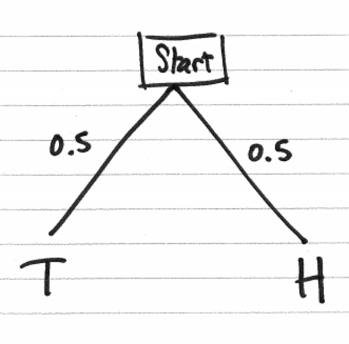
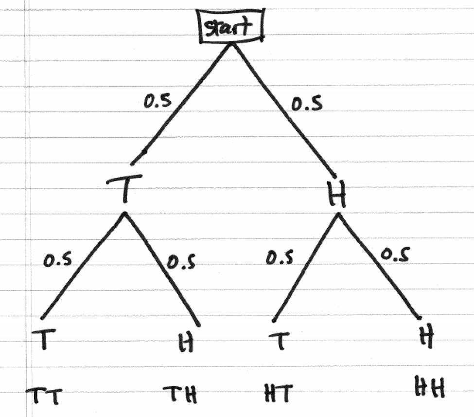
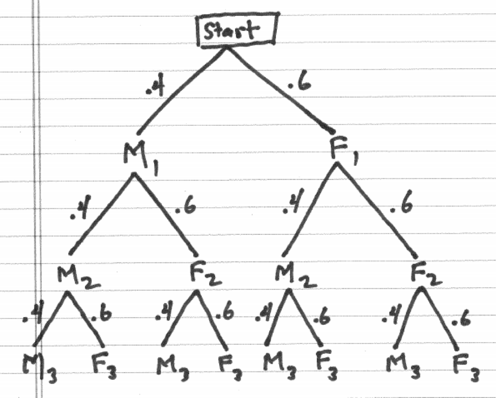
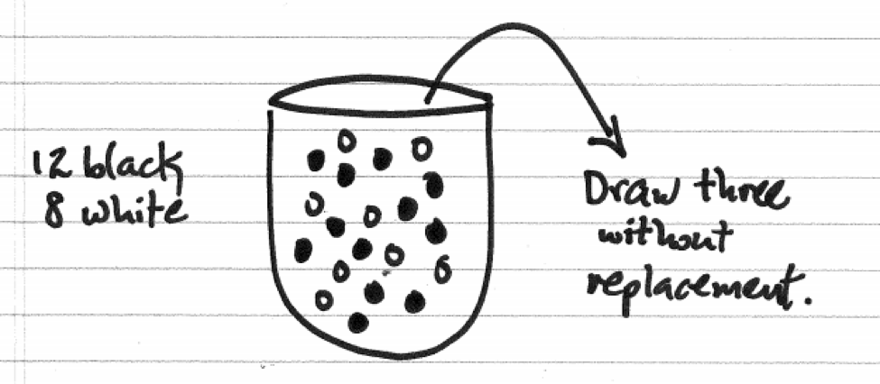
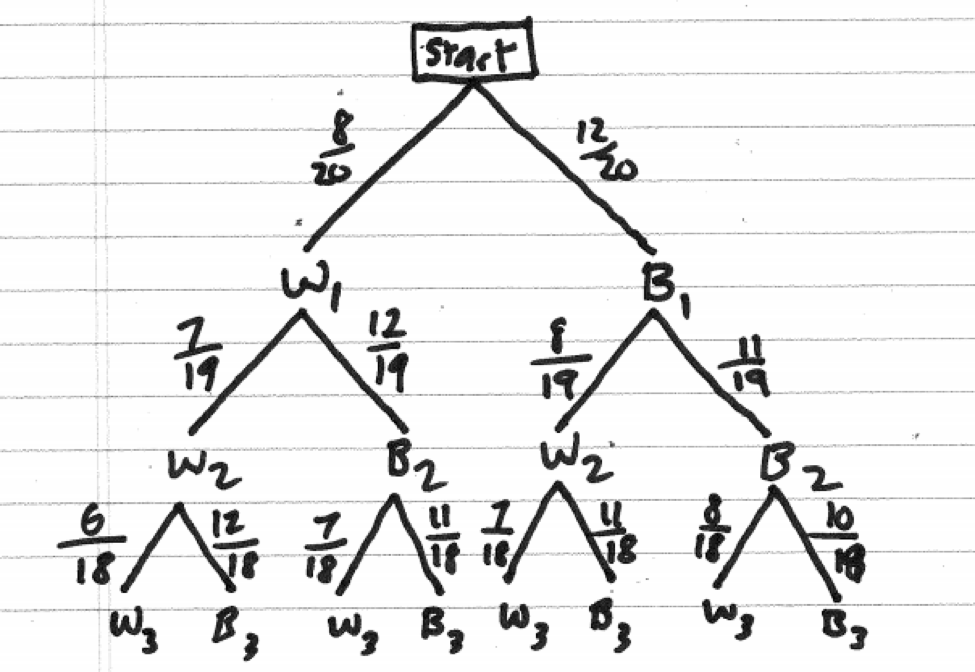
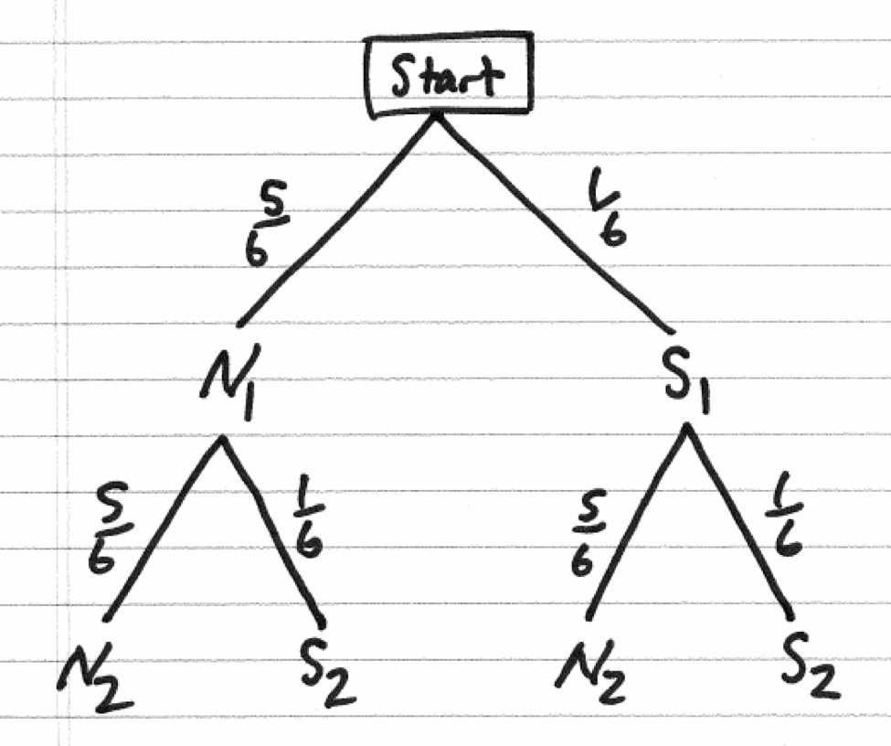

# Coin flips and Chromosomes - Probability Basics and Tree Diagrams {#basics}


```{r, message=FALSE, warning=FALSE, echo=FALSE}
library(mosaic)
set.seed(2018)
```

## Introduction {#introduction}

In this chapter, basic terminology and principles of probability are introduced along with simulation and tree diagrams as important tools to analyze probability questions. 

## Chapter Scenario {#chapter_scenario}

Imagine a simple situation where two coins are tossed and the number of heads is observed and the outcome has some relevance for you depending on whether the result yields 0, 1, or 2 heads. Do you think each of these outcomes is equally likely? What do you think is the probability of each of these outcomes?

We use this coin-flipping scenario as a primary example not because we have inherent interest flipping coins but because this scenario is an effective model for many real-world situations such as gene inheritance. 

## Terminology {#terminology}

**Probability** is the measure of the likelihood of an event on a scale of 0 to 1 where a probability of 1 can be interpreted as certainty the event will occur and a probability of 0 interpreted as certainty the event will NOT occur. There are two main schools of thought regarding what probability is - the frequentist and the bayesian - but for our initial purposes we will think of the probability of an event as the relative frequency of its occurrence in the long run. In very informal shorthand, we think of probability as the ratio of successes to the total number of trials as shown below but must be careful to distinguish between exact theoretical probabilities and approximate empirical probabilities.

$$Probability = \frac{successes}{total}$$

Consider a coin is flipped and we examine whether it lands on heads or tails. We say it is a fair coin if heads and tails are equally likely.  In this case, the probability of the coin landing on heads is $1/2$ which can also be expressed as $0.5$ or $50\%$ meaning that as the experiment is repeated the proportion of heads ultimately approaches 0.50. It does not mean that in any number of trials we will obtain heads exactly $50\%$ of the time as samples will vary.

A **probability experiment** is a process with a random element producing a well-defined outcome such as the tossing of a coin described above and the chapter scenario described above where two coins are flipped and you are interested in whether 0, 1, or 2 heads are seen. An **event** is any well-defined outcome of the probability experiment, such as, the outcome of getting at least one head when flipping two coins. 

We often use function notation when describing probabilities. For event **E** in a probability experiment we will use **P(E)** to represent the probability event E occurs. We also informally use short descriptions of events combined with probability function notation. For example, when flipping one coin we can note $P(heads)=1/2$. 

The **sample space** is a list of all possible outcomes of a probability experiment. One desirable property of a sample space description is that the simple events we use are **equally likely**, meaning all have the same probability of occurring. For example, for the experiment of flipping two coins one might consider $\{0\,heads,\,1\, head,\,2\,heads\}$ as a potential sample space but enquiring minds might wonder whether or not each of these outcomes is equally likely. 

## Simulation {#simulation}

Simulation is often a helpful tool to explore probability questions like the question above regarding whether getting 0, 1, or 2 heads when flipping two coins are all equally likely. The code below simulates 10,000 trials of two coin flips keeping track of the number of heads, number of tails, and proportion of heads for each trial.

```{r nice-tab, tidy=FALSE}
sim_2 <- do(10000)*rflip(n=2, prob=1/2)
knitr::kable(
  head(sim_2), caption = 'Table 1: Two Coin Simulation',
  booktabs = TRUE
)
```

The result is visualized in a histogram of the `heads` variable showing the frequency of obtaining 0, 1, and 2 heads.

```{r nice-fig-1, fig.cap='Histogram for Number of Heads When Flipping Two Coins', out.width='80%', fig.asp=.75, fig.align='center'}
ggplot(data=sim_2, aes(x=heads)) + geom_histogram(aes(y=..density..), binwidth = 1)
```

Examining the histogram we see that obtaining one head is more likely than the other two options and, thus, getting 0, 1, and 2 heads when flipping two coins are not equally likely outcomes. Prompted by the results of the simulation, we want to know why getting one head is more likely and tree diagrams will help us.

## Tree Diagrams {#tree_diagrams}

The outcomes of a probability experiment can be catalogued with a tree diagram where at each node the different branches represent the different possible outcomes at each stage of the process. 

Consider the tree diagram for flipping a single coin where we label each node as either H for Heads or T for tails and label the probability along each branch.

```{r nice-fig-2, fig.cap='Tree Diagram for One Coin', out.width='30%', fig.asp=.75, fig.align='center', echo=FALSE}

```

Including the possible outcomes for a second coin results in a tree diagram with four branches. 

```{r nice-fig-3, fig.cap='Tree Diagram for Two Coins', out.width='60%', fig.asp=.75, fig.align='center', echo=FALSE}

```

Each path from the top of the tree to the bottom represents one possible outcome when tossing two coins. In this experiment, there is a 50/50 chance of getting heads or tails thus all four paths are equally likely each occurring with probability $0.5 \times 0.5 = 0.25$. If we think of the probability associated with each branch as the proportion of the time we travel down that branch then multiplying these probabilities makes perfect sense to determine the probability of traveling down sequential branches.

We can now understand why getting one head is more likely as there are two paths, HT and TH, compared to only one path generating zero heads, TT, and only one path generating two heads, HH, resulting in the following probabilities:

$$P(0\ heads) = P(TT) = (0.5)(0.5) = 0.25$$
$$P(1\ head) = P(TH\ or\ HT) = P(TH) + P(HT) = (0.5)(0.5) + (0.5)(0.5) = 0.25 + 0.25 = 0.5$$

$$P(2\ heads) = P(HH) = (0.5)(0.5) = 0.25$$

### An Example with Rats {#an_example_with_rats}

Now consider the experiment of choosing three rats at random from a large population of rats that is 40% male and 60% female. Just as we did for coins, we can draw a tree diagram with branches representing the sex of the first, second, and third rat chosen and label the associated probabilities on each branch. Selecting the rats and identifying gender would be equivalent to having a coin that lands on one side 40% of the time and on the other 60% of the time. In the tree diagram below, we have added subscripts to identify whether we are referring to the first, second, or third rat selected.

```{r nice-fig-4, fig.cap='Tree Diagram for Three Rats', out.width='60%', fig.asp=.75, fig.align='center', echo=FALSE}

```

What is the probability of selecting 0 female rats? Note that because the population is large at each stage of the process the probability of selecting a female rat is 0.60.

$$P(0\ female\ rats) = P(M_{1}\ and\ M_{2}\ and\ M_{3}) = (0.4) \times (0.4) \times (0.4) = 0.064$$

What is the probability of selecting 1 female rat? There are actually three distinct paths through the tree where 1 female rat and 2 male rats are selected and each one has the probability $(0.6) \times (0.4)^2$ thus the probability is 

$$P(1\ female\ rat) = 3 \times (0.6) (0.4)^2 = 0.288$$

#### Practice Exercise 1
For the probability experiment described above choosing three rats at random from a large population of rats that is 40% male and 60% female, what is the probability of getting 2 female rats? 3 female rats?

#### Practice Exercise 2
Draw a tree diagram for the probability experiment of flipping three coins. Label each node as either H for Heads or T for tails and label the probability along each branch. Find the probabilities of obtaining exactly 0 heads, 1 head, 2 heads, and 3 heads.


## The Urn Model {#the_urn_model}

When confronted with a question of personal importance to you where probabilistic concerns are relevant to getting an accurate answer, the ability to develop a model that captures important probability details is a key problem-solving tool. By **model** we mean a systematic description that shares all of the important characterics of the problem, be it a physical, visual, mathematical, or computational representation (http://www.dictionary.com/browse/model). 

For probability experiments two useful models are the coin-flipping model and the urn model. We have already looked briefly at a coin-flipping experiment. We will see throughout our probabilistic treatment of genetics that we will often use coin-flipping as a mental model to think about questions of genetic risk and reward. The urn model is another important way to think about probability questions. 

Consider an urn with some beads in it. Imagine the urn has 20 beads 12 of which are black and 8 white and we are to draw out three of these beads at random and we want to find the probability of ending up with 0, 1, 2, or 3 black beads. 

```{r nice-fig-5, fig.cap='The Urn Model', out.width='60%', fig.asp=.75, fig.align='center', echo=FALSE}

```

First, we need to be clear up one question: is the drawing out of beads to be done with replacement or without replacement? By **with replacement** we mean that after each draw of one bead, it is replaced, the beads thoroughly mixed, before another bead is selected at random. By **without replacement** we mean that after one bead is removed, it is not replaced before the next bead is selected. Note, if we are selecting three beads at once this could be viewed as equivalent to selecting the beads one at a time without replacement. 

```{r nice-fig-6, fig.cap='Tree Diagram for Three Beads', out.width='60%', fig.asp=.75, fig.align='center', echo=FALSE}

```

For this experiment with three beads drawn at random without replacement from an urn containing 12 black and 8 white beads, what is the probability of ending up with 0, 1, 2, or 3 black beads, respectively?

First, let's tackle the probability of getting 0 black beads. From examining the tree we see 

$$P(0\ blacks) = P(W_{1}\ and\ W_{2}\ and\ W_{3}) = \frac{8}{20} \times \frac{7}{19} \times \frac{6}{18}$$

Finding the probability of one black is more work. As we examine the tree we see there are three distinct paths resulting in one black. Check out their separate probabilities here.

$$P(B_{1}\ and\ W_{2}\ and\ W_{3}) = \frac{12}{20} \times \frac{8}{19} \times \frac{7}{18} = 0.098$$

$$P(W_{1}\ and\ B_{2}\ and\ W_{3}) = \frac{8}{20} \times \frac{12}{19} \times \frac{7}{18} = 0.098$$

$$P(W_{1}\ and\ W_{2}\ and\ B_{3}) = \frac{8}{20} \times \frac{7}{19} \times \frac{12}{18} = 0.098$$

In spite of the numerators being in different orders, we notice that these three separate probabilities are numerically equal. Thus, for the final probability we see

$$P(1\ black) = 3 \times \frac{12}{20} \times \frac{8}{19} \times \frac{7}{18} = 0.295$$

## Ands, Ors, and Nots {#and_ors_nots}

Most of the interesting probability questions involve combinations of simple events. In this section we examine the probabilities of two events both occurring (**and**), at least one of two events occurring (**or**), as well as an event not occurring (**not**).

### In an Attempt to Kill the Student, the Authors Solve the Same Simple Problem Four Ways (One Bad and Three Good) {#kill_the_student}

By dissecting an easy problem we can gain insight into multiple problem-solving strategies that can be useful in other problems. Or we can kill motivation altogether. We will see.

In the game of Risk competitors resolve attacks by rolling dice. Suppose that you are rolling two dice and you are interested in whether or not we obtain a six. We consider the following compound events.

While there are six sides to each die, because we are primarily interested in whether or not we obtain a six, we will use the tree diagram below where event **S** represents getting a six and event **N** represents getting a non-six, ie., 1, 2, 3, 4, or 5.

```{r nice-fig-7, fig.cap='Tree Diagram for Sixes on Two Dice', out.width='60%', fig.asp=.75, fig.align='center', echo=FALSE}

```

Even if we are tossing identical dice simultaneously it is helpful to conceptualize the experiment as if we are tossing the dice sequentially. We have added subscripts to identify whether we are referring to the first die tossed or the second die tossed.

What is the probability of obtaining a six on both dice? Because the two events of getting a six on the first die and getting a six on the second die are **independent**, we can use **The Multiplication Rule for Independent Events** which says for any two independent events $E$ and $F$, $P(E\ and\ F) = P(E) \times P(F)$.

$$P(two\ sixes) = P(S_{1}\ and\ S_{2}) = P(S_{1}) \times P(S_{2}) =  \frac{1}{6} \times \frac{1}{6}$$

What is the probability of obtaining a six on at least one of the two dice? We examine this problem from four points of view - the wrong point of view, the addition rule, the partition technique, and the complement principle.

#### The Wrong Way

Here is a faulty answer:

$$P(at\ least\ one\ six) = P(S_{1}\ or\ S_{2}) = P(S_{1})+ P(S_{2}) = \frac{1}{6} + \frac{1}{6} = \frac{2}{6} = \frac{1}{3}\ \ WRONG!$$

Can you spot the problem? The issue is that one branch with a six on both dice, the overlap where both events $S_{1}$ and $S_{2}$ occur, was counted twice. 

#### The Addition Rule

Here is a correct version using what is called **The Addition Rule** where the overlap, since it was counted twice, is subtracted:

$$P(at\ least\ one\ six) = P(S_{1}\ or\ S_{2}) = P(S_{1})+ P(S_{2}) - P(S_{1}\ AND\ S_{2}) =\\ \frac{1}{6} + \frac{1}{6} - \frac{1}{6} \times \frac{1}{6}  = \frac{11}{36}$$

#### The Partition Approach

An alternative approach is to **partition** the event into mutually exclusive parts. We might informally describe this approach as *divide and conquer*. In this case, there are three distinct branches that satisfy at least one six occurring:

$$P(at\ least\ one\ six) = P(S_{1}\ and\ N_{2}) + P(N_{1}\ and\ S_{2}) + P(S_{1}\ and\ S_{2}) = \\  \frac{1}{6} \times \frac{5}{6} + \frac{5}{6} \times \frac{1}{6} + \frac{1}{6} \times \frac{1}{6} = \frac{11}{36}$$

#### The Complement Principle

A third correct approach uses **The Complement Principle** which observes that for any event $E$, $P(E) = 1 - P(not\ E)$. In this situation, we note $P(at\ least\ one) = 1 - P(none)$. Sometimes it is less work to find the complement of an event and subtract from one.

$$P(at\ least\ one\ six) = 1 - P(no\ sixes) = 1 - P(N_{1}\ and\ N_{2}) = \\  1 - \frac{5}{6} \times \frac{5}{6} = \frac{11}{36}$$

To summarize what we have learned about problem-solving here, there is more than one way to solve a probability problem (and some ways are wrong!). But several good strategies to use are the addition rule being careful not to double-count, divide and conquer by partitioning the event into mutually exclusive pieces, or use the complement principle to solve the opposite problem and subtract this from one. 