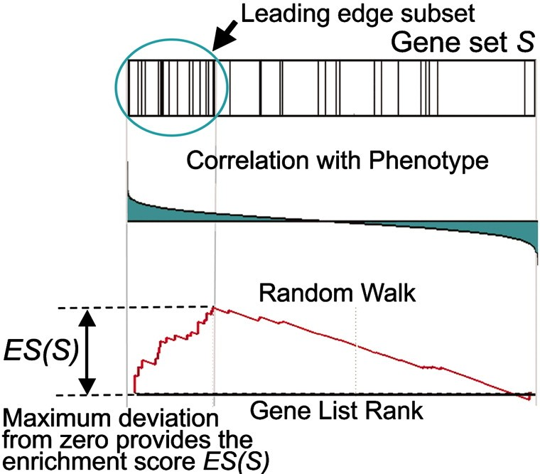

```{r setup, include=FALSE}
knitr::opts_chunk$set(warning = FALSE, 
        message = FALSE, echo = FALSE)
knitr::opts_chunk$set(tidy.opts = list(width.cutoff = 60), 
                      tidy = TRUE)
suppressPackageStartupMessages({
library(clusterProfiler)
library(fgsea)
library(enrichplot)
library(annotate)
library(ggplot2)
library(dplyr)
library(org.Hs.eg.db)})
```

# Gene Set Enrichment Analysis

The .Rmd file for this chapter can be found [here](https://github.com/gurinina/omic_sciences/blob/main/35GSEA.Rmd). To begin learning aobuto GO set enrichmet analysis and the different methods that can be utiliazed to preform these analysis a good jumping off start point is this Natural Protocols paper:

As a change a pace I thought we would go through this very helpful paper written...

Pathway enrichment analysis and visualization of omics data using g:Profiler, GSEA, Cytoscape and EnrichmentMap 

Jüri Reimand, Ruth Isserlin, Veronique Voisin, Mike Kucera, Christian Tannus-Lopes, Asha Rostamianfar, Lina Wadi, Mona Meyer, Jeff Wong, Changjiang Xu, Daniele Merico and Gary D. Bader. Pathway enrichment analysis helps researchers gain mechanistic insight into gene lists generated from genome-scale (omics) experiments. This method identifies biological pathways that are enriched in a gene list more than would be expected by chance. We explain the procedures of pathway enrichment analysis and present a practical step-by-step guide to help interpret gene lists resulting from RNA-seq and genome-sequencing experiments. The protocol comprises three major steps: definition of a gene list from omics data, determination of statistically enriched pathways, and visualization and interpretation of the results. We describe how to use this protocol with published examples of differentially expressed genes and mutated cancer genes; however, the principles can be applied to diverse types of omics data. The protocol describes innovative visualization techniques, provides comprehensive background and troubleshooting guidelines, and uses freely available and frequently updated software, including g:Profiler, Gene Set Enrichment Analysis (GSEA), Cytoscape and EnrichmentMap. The complete protocol can be performed in ~4.5 h and is designed for use by biologists with no prior bioinformatics training.

Comprehensive quantification of DNA, RNA and proteins in biological samples is now routine. The resulting data are growing exponentially, and their analysis helps researchers discover novel biological functions, genotype–phenotype relationships and disease mechanisms1,2. However, analysis and interpretation of these data represent a major challenge for many researchers. Analyses often result in long lists of genes that require an impractically large amount of manual literature searching to interpret. A standard approach to addressing this problem is pathway enrichment analysis, which summarizes the large gene list as a smaller list of more easily interpretable pathways. Pathways are statistically tested for over-representation in the experimental gene list relative to what is expected by chance, using several common statistical tests that consider the number of genes detected in the experiment, their relative ranking and the number of genes annotated to a pathway of interest. For instance, experimental data containing 40% cell cycle genes are surprisingly enriched, given that only 8% of human protein-coding genes are involved in this process. In a recent example, we used pathway enrichment analysis to help identify histone and DNA methylation by the polycomb repressive complex (PRC2) as the first rational therapeutic target for ependymoma, one of the most prevalent childhood brain cancers3. This pathway is targetable by available drugs such as 5-azacytidine, which was used on a compassionate basis in a terminally ill patient and stopped rapid metastatic tumor growth3. In another example, we analyzed rare copynumber variants (CNVs) in autism and identified several significant pathways affected by gene deletions, whereas few significant hits were identified with case–control association tests of single genes or loci4,5. These examples illustrate the useful insights into biological mechanisms that can be achieved using pathway enrichment analysis.


## Application to diverse omics data
This protocol uses RNA-seq data7 and somatic mutation data6 as examples because these data types are frequently encountered. However, the general concepts of pathway enrichment analysis that we present are applicable to many types of experiments that can generate lists of genes, such as single-cell transcriptomics, CNVs5, proteomics63, phosphoproteomics64, DNA methylation65 and metabolomics. Most data types require protocol modifications, which we only briefly discuss here. With certain data types, specialized computational methods are required to produce a gene list that is appropriate for pathway enrichment analysis, whereas with other data types, a specialized pathway enrichment analysis technique is required. Issues specific to data types and experimental methods must be considered, including: 

**Different gene identifiers are recommended for certain data types.** We recommend UniProt accession numbers for proteins (e.g., Q00987 for MDM2) and Human Metabolome Database IDs for metabolites (e.g., ATP is denoted as HMDB00538). 

**Certain types of omics experiments by design capture only a subset of genes or proteins.** To address this limited coverage, pathway enrichment analysis must define a custom background gene set of the genes that can be measured in the experiment. For example, phosphoproteomics experiments measure only proteins with one or more phosphorylation sites and thus must use the set of genes encoding phosphoproteins as the custom background gene set. Otherwise, pathway enrichment analysis would reveal inflated P values for general processes such as kinase signaling and protein phosphorylation. 

**Pathway enrichment analysis of short non-coding genomic regions such as transcription factor binding sites from ChIP-seq experiments need additional consideration.** Genomic regions must be mapped to protein-coding genes and corrected for biases such as increased signal in longer genes. Tools such as GREAT(67) automatically perform both tasks. 

**Large genomic intervals that span multiple genes (e.g., from genome-wide associations, CNV and differentially methylated regions) require specialized enrichment tests such as the PLINK CNV gene set burden test68 or INRICH69.** Standard enrichment tests often reveal genes clustered in the genome whose signals are strongly statistically inflated because each gene is incorrectly counted as an independent signal. Gene types that are correlated with genomic position include olfactory receptors, histones, major histocompatibility complex (MHC) members and homeobox transcription factors. A simple solution to address genomic clustering of genes in a pathway involves selecting only one representative gene from each functionally homogeneous genomic cluster before enrichment analysis. 

**For rare genetic variants, case–control pathway ‘burden’ tests are the most appropriate pathway enrichment analysis method.**

## Pathway enrichment analysis methods
This protocol recommends the use of g:Profiler and GSEA software for pathway enrichment analysis. g:Profiler13,39 analyzes gene lists using Fisher’s exact test and ordered gene lists using a modified Fisher’s test. It provides a graphical web interface and access via R and Python programming languages. The software is frequently updated, and the gene set database can be downloaded as a GMT file (http://biit.cs.ut.ee/gprofiler). GSEA14 analyzes ranked gene lists using a permutation-based test. The software typically runs as a desktop application (http://software.broadinstitute.org/gsea). Hundreds of pathway enrichment analysis tools exist (reviewed in ref. Khatri, P., Sirota, M. & Butte, A. J. Ten years of pathway analysis: current approaches and outstanding challenges. PLoS Comput. Biol. 8, e1002375 (2012)), although many rely on outof-date pathway databases or lack unique features as compared to the most commonly used tools; as such, we do not cover them here. The following are alternative free pathway enrichment analysis software tools. Although we do not cover these tools in our protocol, we recommend the following, on the basis of their ease of use, unique features or advanced programming features.

## Comparison to alternative methods 
(See paper for referenes)
Enrichr(37): This is a web-based enrichment analysis tool for non-ranked gene lists that is based on Fisher’s exact test. It is easy to use, has rich interactive reporting features, and includes >100 gene set databases (called libraries), including >180,000 gene sets in multiple categories. Functionality is similar to that of the g:Profiler web server described in this protocol. 

[Camera(71)](https://bioconductor.org/packages/release/bioc/html/limma.html): This R Bioconductor package analyzes gene lists and corrects for inter-gene correlations such as those apparent in gene co-expression data. The software is available as part of the limma package in Bioconductor; (this is an advanced tool that requires programming expertise; Supplementary Protocol 3). 
(similar to moast and roast)

[GOseq(72)](https://bioconductor.org/packages/release/bioc/html): This R Bioconductor package analyzes gene lists from RNA-seq experiments by correcting for user-selected covariates such as gene length; this is an advanced tool that requires programming expertise). 

[Genomic Regions Enrichment of Annotations Tool (GREAT)(67)](http://bejerano.stanford.edu/great/public/html/): In contrast to common methods that analyze gene lists, GREAT analyzes genomic regions such as DNA binding sites and links these to nearby genes for pathway enrichment analysis . See ‘Application to diverse omics data’ section. PROTOCOL NATURE PROTOCOLS 492 NATURE PROTOCOLS | VOL 14 | FEBRUARY 2019 | 482–517 | www.nature.com/npro

## Visualization tools 
This protocol recommends the use of EnrichmentMap for pathway enrichment analysis visualization to aid interpretation. EnrichmentMap(16) is a Cytoscape15 application that visualizes the results from pathway enrichment analysis and eases interpretation by displaying pathways as a network in which overlapping pathways are clustered together to identify major biological themes in the results (http:// www.baderlab.org/Software/EnrichmentMap). Two alternative useful visualization tools are: 

ClueGO(40): This Cytoscape application is conceptually similar to EnrichmentMap and provides a network-based visualization to reduce redundancy of results from pathway enrichment analysis. It also includes a pathway enrichment analysis feature for analysis of GO annotations using Fisher’s exact tests. However, it currently supports only GO gene sets. 

PathVisio(49): This desktop application provides a complementary visualization approach to those of EnrichmentMap and ClueGO. PathVisio enables the user to visually interpret omics data in the context of gene and protein interactions in a pathway of interest. [PathVisio](https://www.pathvisio.org) colors pathway genes according to user-provided omics data . This is the main advantage of PathVisio as compared to EnrichmentMap and ClueGO.

Topology-aware pathway analysis methods Most pathway enrichment analysis methods treat all genes in a pathway uniformly and ignore gene interactions. By contrast, topology-aware methods explicitly model the interactions between genes. CePa(73), GANPA(74) and THINK-Back(75) use physical gene interactions or co-expression networks to assign a weight to each gene in each pathway. Weights can be derived from measures of the gene importance in the network such as degree, the number of gene connections and betweenness centrality, and can be integrated into a traditional pathway enrichment analysis method such as GSEA. Methods such as SPIA(76), Pathway-Express(77) and EnrichNet(78() generate an ES for the entire pathway that considers pathway regulatory interactions such as activation and inhibition. Although useful and potentially more accurate, regulatory and biochemical gene interactions are available for fewer genes and pathways as compared to physical interactions networks and co-expression. We anticipate that these methods will become more useful as more gene interactions in pathways are characterized in detailed molecular experiments. However collecting and curating high-quality and biochemically detailed pathway data from the literature is currently complex and expensive. Therefore, pathway enrichment analysis methods described in this protocol will probably remain the most widely used approaches for the foreseeable future. Future perspectives Current pathway enrichment analysis methods provide a useful high-level overview of the pathways active in a genomics experiment. However, these methods consider a simplified pathway view that involves only gene sets. Next-generation pathway analysis methods will integrate more biological pathway details, build pathway models based on multiple types of genomics data measured across many samples, and consider positive and negative regulatory relationships in the data. For instance, qualitative mathematical modeling parameterized with single-cell RNA-seq data may one day enable accurate predictions of drug combinations capable of treating a given disease under study.


## Development of the protocol
This protocol covers pathway enrichment analysis of large gene lists typically derived from genomescale (omics) technology. The protocol is intended for experimental biologists who are interested in interpreting their omics data. It requires only an ability to learn and use  R programming language and 'point-and-click' computer software, although advanced users can benefit from the automatic analysis scripts we provide as Supplementary Protocols 1–4. We analyze previously published human gene expression and somatic mutation data as examples 6–8; however, our conceptual framework is applicable to analysis of lists of genes or biomolecules from any organism derived from large-scale data, including proteomics, genomics, epigenomics and gene-regulation studies. We extensively use pathway enrichment analysis for many projects and have evaluated numerous available tools9–12. The software packages we cover here have been selected for their ease of use, free access, advanced features, extensive documentation and up-to-date databases, and they are ones we use daily in our research and recommend to collaborators and students. In addition, we have provided feedback to the developers of these tools, allowing them to implement features we have needed in published analyses. These tools are g:Profiler(13), GSEA(14), Cytoscape(15) and EnrichmentMap(16), all freely available online: 

[g:Profiler](https://biit.cs.ut.ee/gprofiler/) 
[GSEA](http://software.broadinstitute.org/gsea/) 
[Cytoscape](http://www.cytoscape.org/)
[EnrichmentMap](http://www.baderlab.org/Software/EnrichmentMap) 

## Overview of the procedure 
This section outlines the major stages of pathway enrichment analysis. A detailed step-by-step protocol is provided in the Procedure below. Pathway enrichment analysis involves three major stages (Fig. 1; see Box 1 for basic definitions). 1 Definition of a gene list of interest using omics data. An omics experiment comprehensively measures the activity of genes in an experimental context. The resulting raw dataset generally requires computational processing, such as normalization and scoring, to identify genes of interest,

Now we have our ranked file and our gmt file; ahd they are in the correct format to run 
fgsea:

fgsea requires a rank file and a pathway file

by using the gmtPathways function in fgsea, the format is as follows:

a list, with pathways as names of the list, and genes as members of the pathwyas --

or alternatively GO terms and gene set members.


```{r ranked list}
prank = read.delim("STable2_MesenvsImmuno_RNASeq_ranks.rnk",stringsAsFactors = F,check.names = F)
pathways = gmtPathways(gmt.file = "STable3_hGOBP_no_iea_July012017_gene.gmt")

ranks = prank$rank
names(ranks) = prank$GeneName
wdup = which(duplicated(names(ranks)))
if(length(wdup) >0) ranks=ranks[-wdup]
```
to run fgsea:
```{r run fgsea}
fgseaRes = fgseaSimple(pathways=pathways,stats=ranks,nperm=1000,maxSize = 200,minSize = 15)
```
```{r plot}
topPathwaysUp <- fgseaRes[ES > 0][head(order(pval), n=5), pathway]
topPathwaysDown <- fgseaRes[ES < 0][head(order(pval), n=5), pathway]
topPathways <- c(topPathwaysUp, rev(topPathwaysDown))
plotGseaTable(pathways[topPathways], ranks, fgseaRes,colwidths = c(8, 3, 0.8,0,1))

plotEnrichment(pathways[[topPathways[1]]], ranks)

```
Lets talk a little bit about how GSEA works.

Sort genes by log fold change
Calculate running sum: incremented when gene in set, decremented when not.
Maximum of the running sum is enrichment score ES; large ES means that genes in set are toward top of list.
Permuting subject labels for signficance.


I wrote a function here to save time filtering and sorting outputs of 
GSEA unfriendly outputs:

```{r GSEA sort and tidy output}
mygseatidy = function(result){

nam=names(data.frame(result))
wnam = which(nam== "enrichmentScore")
if(length(wnam)>0) nam[wnam]="ES"
wnam = which(nam== "p.adjust")
if(length(wnam)>0) nam[wnam]="padj"
pres = data.frame(result) %>% filter(ES>=0)%>% arrange(desc(ES),padj)
nres = data.frame(result) %>% filter(ES<0)%>% arrange(ES,padj)
return(list(nres=nres,pres=pres))
}
```
let's look at the results:
```{r results}
fnegsea = mygseatidy(fgseaRes)$nres
fposgsea = mygseatidy(fgseaRes)$pres
```
lets compare this to the output run by the GSEA desktop version of Cytoscape covered in the paper. I would really encourage you to run on your own, it's a great interface and a lot of fun to work with.

Here I am just reading in the supplementarty tables of the negative and positive GSEA results.
```{r}

ppos = read.delim(file = "STable8_gsea_report_for_na_pos.txt" ,stringsAsFactors = F,
                  check.names = F)

pneg = read.delim(file = "STable9_gsea_report_for_na_neg.txt" ,stringsAsFactors = F,
                  check.names = F)
ppos = ppos %>% arrange(desc(ES),`FDR Q-VAL`)
pneg = pneg %>% arrange(ES,`FDR Q-VAL`)

intersect(fposgsea$pathway[1:10],ppos$TERM[1:10])

intersect(fnegsea$pathway[1:10],pneg$TERM[1:10])
```


term2go <- AnnotationDbi::select(GO.db,keys = keys(GO.db),
columns=c("GOID","TERM","DEFINITION"), 
                keytype="GOID")
                
Quick annotation brushup:
head(keys(org.Hs.eg.db))

 
#store the first six keys
my_keys <- head(keys(org.Hs.eg.db))
 
keytypes(org.Hs.eg.db)

 
same as above
columns(org.Hs.eg.db)

 
selecting
select(org.Hs.eg.db,
       keys = my_keys,
       columns=c("ENTREZID","SYMBOL","GENENAME"),
       keytype="ENTREZID")
 
ENTREZID  SYMBOL  GENENAME


gene.df <- bitr(gene, fromType = "SYMBOL",
        toType = c("ENSEMBL", "SYMBOL"),
        OrgDb = org.Hs.eg.db)
```{r}        
ego2 <- enrichGO(gene  = names(rank)[1:100],
        OrgDb         = org.Hs.eg.db,
        keyType       = 'SYMBOL',
        ont           = "BP",
        pAdjustMethod = "BH",
        pvalueCutoff  = 0.01,
        qvalueCutoff  = 0.05)
```

```{r}
# gse <- gseGO(geneList=rank,
#         ont ="BP",
#         keyType = "SYMBOL",
#         eps = 0,
#         minGSSize = 15,
#         maxGSSize = 200,
#         pvalueCutoff = 0.05,
#         verbose = TRUE,
#         OrgDb = org.Hs.eg.db,
#         pAdjustMethod = "BH",by = "DOSE")
# 
#         x2 = pairwise_termsim(gse)
#         emapplot(x2, showCategory = 20)
#         dotplot(gse, showCategory=3, split=".sign") +         facet_grid(.~.sign)
# 
# 


```
Finally, I'm going to show you a GO enrichment tool that we developed in our lab:
```{r}
source("2022_March13_GORESP.R")
go_path = "2021_Decenber30_GOID_GOBP_SGD.txt"
bp_path = "2021_Decenber30_GO_BP.RDS"
d3 = as.matrix(read.delim("d3matrix.txt",stringsAsFactors = F,check.names = F))
goresp = runGORESP(fdrThresh = 0.2,curr_exp = colnames(d3)[43], d3, 43, sig = 1, bp_path = bp_path,go_path = go_path)
```

The GO enrichment itself is basically GSEA, so we don't need to go over that bit in detail.

In the GSEA, instead of using a ranked list however, we used a list of "significant genes" and compared it 
to a set of background genes, instead of using a ranked list. This decision is very much based on
our platform. Our platform is a chemogenomics assay and the uniqueness of our assay is that
unlike RNA expressioin, for example, the assay returns a ranked list of genes, but in this case
the ranked list informs is directly informative of the importance of each gene to the biological question.
In this case, the biological question is how important is that gene for resistance to a particular 
compound or drug? In expression, a larger fold change in expression in response to perturbation 
does not necessarily imply that that gene is more important for adaptation or resistance to the change
in perturbation, but in our chemogenomic assay, a larger change in resistance, in this case measured
as a change in fitness, or growth does tell us exactly that. So that is why we opt not to use the ranked
list approach. There is still the issue of where to draw the cutoff, but we have overcome that after years
of experience with the assay and being intimately familiar with the level of sensitivity and what level
of sensitivitiy we are comfortable with calling statistically significant.

Ok. So for a GO enrichment with a significant set of genes and a background list we can model the association between genes and GO class using a hypergeometric distribution. The classical example for the hypergeometric is the ranomdly selection of “k” balls in an urn containing “m” marked and “n” non-marked balls (e.g. black and white balls), and the observation that the selection contains “x” marked ball. 	


To illustrate the way to perform the hypergeometric test, we will re-analyze one of the enrichment results
from the test we just performed.


We define the parameters of the hypergeometric test in the following way:

Variable Description
m = 9	number of “marked” elements, i.e. total number of genes annotated for the selected GO term (ARGININE BIOSYNTHETIC PROCESS).
N = 4797 total number of genes with a score the test matrix. 
n = N−m = 4785	number of “non-marked” elements, i.e. the number of genes that have some annotation, but are not associated to the selected GO term (ARGININE BIOSYNTHETIC PROCESS).
k = 191	Size of the query selection, i.e. number of genes designated as significant, and associated to at least one “Biological Process” in the Gene Ontology.
x = 8	number of “marked” elements in the selection, i.e. number of query genes overlapping the geneSet AND associated with ARGININE BIOSYNTHETIC PROCESS in GO annotations.


```{r 2 x 2 table}
compSCORE <- function(mat,coln, sig = 1){
   df = data.frame(score = mat[,coln],stringsAsFactors = F)
   suppressPackageStartupMessages({library(dplyr)})
   df$gene = rownames(mat)
   rownames(df) = df$gene
   df$index=0
   wdf = which(df$score >= sig)
   df$index[wdf]=1
   df = df[,c('index','score','gene')]
   df = df %>% arrange(desc(score))
   df
   }
# in order to find N, we need to find how many genes have a non-NA score in the relevant column of interest
score = compSCORE(mat = d3, coln = 43, sig = 1)
## k is length of queryset, nQuery
k = sum(score$index == 1) #querySet
## N = universe, nrow in  matrix
N = sum(!is.na(score$score)) #universe
##for ARGININE BIOSYNTHESIS
goresp$enrichInfo[3,]
## m is the number of successes in population = geneSetsize ##success in population, nGenes
m = goresp$enrichInfo$nGenes[3]

## n = N - m number of “non-marked” elements, 
## i.e. the number of genes that have some              annotation, but are not associated to the selected GO term (ARGININE BIOSYNTHETIC PROCESS)
n = N - m
## number of “marked” elements in the selection, i.e. number of query genes overlapping the geneSet AND associated with ARGININE BIOSYNTHETIC PROCESS in GO annotations.
x = goresp$enrichInfo$nOverlap[3]
## q = length overlap-1 #successes in querySet, nOverlap
q = x -1
phyp = phyper(q = x-1,m,n,k,lower.tail = F)
#probability that X os greater than overlap
signif(phyp,3)
goresp$enrichInfo$P[3]

```

This is equivalent to setting up a contingency table and doing a Fisher's exact test:

```{r contingency}

  
## q = length overlap-1 #successes in querySet
## m is the number of successes in population = geneSetsize 
## success in population
## n = N - m
## k is length of queryset
## N = universe, nrow in  matrix
## Prepare a two-dimensional contingency table
contingency.table <- data.frame(matrix(nrow=2, ncol=2))
rownames(contingency.table) <- c("predicted.target", "non.predicted")
colnames(contingency.table) <- c("class.member", "non.member")
 
## Assign the values one by one to make sure we put them in the right
## place (this is not necessary, we could enter the 4 values in a single instruction).
contingency.table["predicted.target", "class.member"] <- x 
## Number of marked genes in the selection
contingency.table["predicted.target", "non.member"] <- k - x 
## Number of non-marked genes in the selection
contingency.table["non.predicted", "class.member"] <- m - x 
## Number of marked genes outside of the selection
contingency.table["non.predicted", "non.member"] <- n - (k - x) ## Number of non-marked genes in the selection
fish = fisher.test(contingency.table , alternative = "greater")
  (contingency.row.sum = apply(contingency.table, 1, sum))
fish$p.value


(contingency.col.sum = apply(contingency.table, 2, sum))
## Create a contingency table with marginal sums
exp.contingency.table <- cbind(contingency.table, contingency.row.sum)
exp.contingency.table <- rbind(exp.contingency.table, apply(exp.contingency.table, 2, sum))
names(exp.contingency.table) <- c(names(contingency.table), "total")
rownames(exp.contingency.table) <- c(rownames(contingency.table), "total")
print(exp.contingency.table)
```
I find that this is a useful way to grasp the phyper function, where it's easy to get confused about what the balls are and what's marked and what's unmarked. This lays it out very clearly. Contingency tables also really shine at highlighting joint probabilities because each cell displays the number of times events occurred together. Those cell values are the joint events for the numerator. The grand total is the number of outcomes for the denominator.  


Under the hypothesis of independence, we would expect to find the genes distributed randomly within the table, but with the same marginal row and column sums. We can therefore estimate the expected number of elements in each cell by taking the product of the total entries in the row and column, and dividing it by the total number of genes because these joint probabilities must be additive under the laws of independence. If you really want to test for independence these estimates could then be used to test in a chisq.test.

OK, lets move on.

So now we're going to use the results from the hypergeometric tests to do some visualization and construct
a network of GO enrichments. So right now our data is in the form of an enrichment dataframe with
lots of nice annotation -- FDR values, geneSetSize and all those nice details we just looked at.

The other piece of the data that got generated in this "runGORESP" function was an edge matrix, and I am
not going to go through all the details here, you can go through the code on your own time, its pretty
straight forward. Basically what it does is it takes all of the enriched geneSets and it walks throgh them
systematically comparing all pairwise combinations to calculate the overlap coefficient between them. So here again is yet another method for simplifying the output and trying to minimize the rendundancy between
terms. We saw it with the collapsePathways in fgsea, and the packages GOSemSim, DOSE, enrichplot and meshes have implemented a variety of tools based on semantic similarity of genes or gene products using [Gene Ontology, Disease Ontology and Medical Subject Headings] (https://yulab-smu.top/biomedical-knowledge-mining-book/index.html). The GO semanitic similarities are
similar to GO slim methods, where child GO terms are collapsed into more general terms, but as far as I can
tell the data is not that easy to manage.

Visualization:

```{r}
############
# generates parameters for drawing GO enrichment networks
# enrichInfo - dataframe with enrichment stats for gene sets 
# (one per row), with the following columns:
# filename, term, geneSetFraction, FDR, overlapGenes, 
# maxOverlapGeneScore
# -- see documentation for the output of hyperG() for 
# descriptions of these columns
# -- rows with the same value, x, in the filename column specify
# enrichment results for the set of query genes in 
# queryGeneSets with name = x
# edgeMat - dataframe of edge set info: id=gene set id, 
# cluster=cluster id, es=enrichment score, fdr=FDR value
#
#####
visSetup = function(enrichInfo, edgeMat, fontsize = 22, fontface = "Arial") {

  suppressPackageStartupMessages({library(igraph)
  library(visNetwork)})
  n = enrichInfo
  e = edgeMat

  w = which(names(n) == "id")
  coln = (1:ncol(n))[-w]
  n = n[, c(w, coln)]

  if (is.null(e) & !is.null(n)) {
    gr = make_empty_graph(nrow(enrichInfo))
    v = gr
    V(v)$color.background = n$cluster
    v = set_vertex_attr(v, "label", value = n$formattedLabel)

  }


  if (!is.null(e) & !is.null(n)) {
    w = which(names(e) == "label")
    let = graph_from_data_frame(e[, -w], vertices = n, directed = F)
    v = set_vertex_attr(let, "label", value = n$formattedLabel)
    V(v)$color.background = n$cluster
  }

  vis = toVisNetworkData(v)
  vis$nodes = data.frame(vis$nodes, stringsAsFactors = F)
  if (!is.null(vis$edges))
    vis$edges = data.frame(vis$edges, stringsAsFactors = F)
  m = match(vis$nodes$id, n$id)
  vis$nodes$label = n$formattedLabel[m]
  vis$nodes$FDR = n$FDR[m]
  vis$nodes$FDR = signif(vis$nodes$FDR, 5)


  w = which(duplicated(vis$nodes$FDR))
  if (length(w) > 0) {
    vis$nodes =  vis$nodes %>% group_by(FDR) %>% mutate(
      jitter = if (n() > 1)
        abs(jitter(FDR))
      else
        (FDR)
    )

    w = which(names(vis$nodes) == "FDR")
    vis$nodes = vis$nodes[, -w]
    w = which(names(vis$nodes) == "jitter")
    names(vis$nodes)[w] = "FDR"
    vis$nodes$FDR = signif(vis$nodes$FDR, 6)
  }

  w = which(duplicated(vis$nodes$FDR))


  vis$nodes$term = n$term[m]
  vis$nodes$nOverlap = n$nOverlap[m]
  vis$nodes$nQuery= n$nQuery[m]
  vis$nodes$nGenes = n$nGenes[m]
  vis$nodes$geneSetFraction = n$geneSetFraction[m]
  vis$nodes$querySetFraction = n$querySetFraction[m]
  vis$nodes$filename =  n$filename[m]

  vis$nodes$formattedLabel = n$formattedLabel[m]
  vis$nodes$overlapGenes = n$overlapGenes[m]
  vis$nodes$label = vis$nodes$formattedLabel
  vis$nodes$color.border = "black"
  vis$nodes = vis$nodes %>% arrange(label)
  if (nrow(vis$edges) > 0)
    vis$edges$color = "black"

  vis$nodes$borderWidthSelected	= 4
  w = which(names(vis$nodes) %in% c("fomattedLabel", "color", "cluster"))
  if (length(w) > 0)  vis$nodes = vis$nodes[, -w]
  vis$nodes$color.highlight.border = "#000066"
  vis$nodes$color.highlight.background = "#c0b3ff"
  vis$nodes$color.hover.background = "#000066"
  vis$nodes$color.hover.border = "#c0b3ff"
  vis$nodes$font.face = fontface
  vis$nodes$shape = "dot"
  vis$nodes$font.size = fontsize
  vis$nodes$font.bold = F
  vis$nodes$borderWidth = 2
  #vis$nodes$vadjust = "mono"
  vis$nodes$borderWidthSelected = 4
  vis$nodes$labelHighlightBold = T
  w = which.min(vis$nodes$FDR)
  if (length(w) > 0) {
    vis$nodes$font.size[w] = fontsize + 4
    vis$nodes$borderWidth[w] = 4
    vis$nodes$font.bold[w] = T
  }
  vis$nodes = vis$nodes %>% arrange(FDR)
  vis

}
############
# generates a network based on node and edge parameters
############
runNetwork <- function(nodes,edges){
  suppressPackageStartupMessages({library(igraph)
  library(visNetwork)})
  visNetwork(nodes,edges, width = "100%") %>%
    visNodes(shadow=list(enabled = T,size = 25)) %>%
    visOptions(
      highlightNearest = list(enabled = T, degree = 5, hover = T),
      nodesIdSelection = list(enabled = TRUE, values = names,
                              style = 'width: 250px;color: #000066;'),
      selectedBy = list(variable="FDR",
                        style = 'width: 250px;color: #000066;')) %>%

    visIgraphLayout(type = "full")


}

vis = visSetup(enrichInfo = goresp$enrichInfo,edgeMat = goresp$edgeMat, fontsize = 14)

runNetwork(nodes = vis$nodes,edges=vis$edges)
```
enrichGO, gseGO, enricher, goana, go_enrich, gost etc.
Over representation analysis: goprofiler2, clusterProfiler, GOfuncR, limma, goseq, topGO 
GSEA: fgsea, GSEA, ViSEAGO, RGSEA
A word about genesets:
```{r}]
library(org.Sc.sgd.db)
ego <- enrichGO(gene = gene,
                universe = universe,
                OrgDb         = org.Sc.sgd.db,
                keyType       = 'GENENAME',
                ont           = "BP",
                minGSSize = 5,
                maxGSSize = 300,
                pAdjustMethod = "BH",
                pvalueCutoff  = 0.01,
                qvalueCutoff  = 0.05,
                readable = FALSE)
dotplot(ego, showCategory=10)
```
One of the most important things to remember about geneset analysis
is that genesets are constantly being updated. Many of the R packages 
we are using, I have noticed! don't update their files to reflect this. 
Therefore the safest way to ensure you are using the most up-to-date file
is to download it from the GO ontology consortium website [Gene Ontology Consortium](http://current.geneontology.org/products/pages/downloads.html). The GO ontology constortium updates their files constantly and have all the model organism genesets. Another good sourcce for Human, woodchuck, rat and mouse data is Gary Bader's at the Univerisity of Toronto's website [Gary Bader Enrichment Map Gene Sets](http://baderlab.org/GeneSets). There they have serveral versions of the gmt files separated into GO ontologies, plus/minus IEAs, +/ pathway annotations etc.

Go through GAF file:
        1. filter for ontology: most commonly people use BP
        2. filter for evidence codes: most commonly, IEA and other                      
              computational codes are filtered out, but it 
              depends on the organism -- if the organism is not
              well annotated, you may want to choose to leave it in
        3. sometimes people filter for source
        or whatever process you prefer, fiORFs, duplicated genes. filter for IEA

For an expression experiment, to generate a rank file one should add these columns:
        1. sign (sign of logFC) 
        2. logP = -log10(Pvalue)
        3. combine these into a score and include the gene name; such that                 
                a large logP implies
                a highly significant gene, and the sign just reflects
                the direction of that logFC.

anno <- select(org.Hs.eg.db, keys=topgenes,
               columns=c("SYMBOL","GENENAME"), 
               keytype="ENSEMBL")
anno <- select(orgdatabase, keys=selectheserecords,
               columns=c(retrievetheserecords), 
               keytype=keytypeofrecord)
mapIds(Orgdb, keys = selectheserecords, column = retrievetheserecords,keytype=keytypeofrecord)            
AnnotationDbi::select(org.Hs.eg.db, tbl$ENTREZID, "GOALL", "ENTREZID") 


dplyr::select(GOID = GOALL, Ont = ONTOLOGYALL, ENTREZID) %>%
distinct() %>%
arrange(Ont, GOID)               
               
 mapIds(org.Hs.eg.db, ENSEMBL, "ENTREZID", "ENSEMBL")              
 mapIds(Orgdb, keys = selectheserecords, column = retrievetheserecords, keytype=keytypeofrecord)
 

